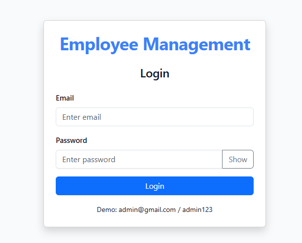
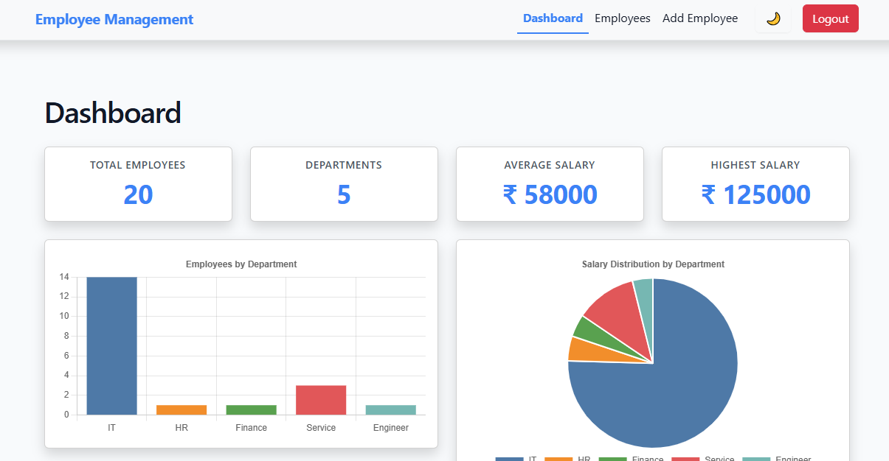
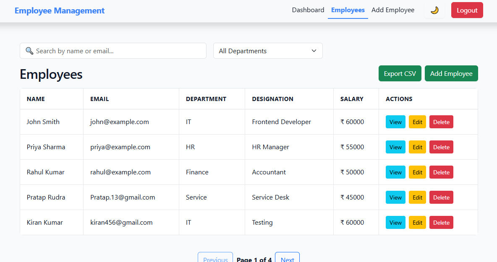

# Employee Management System

A responsive Employee Management System built with React and Vite. The application provides employee CRUD operations, dashboard analytics, authentication, search, filtering, sorting, pagination, charts, CSV export, and dark/light theme support.

## 🚀 Live Demo

Live Application: https://employee-management-alpha-umber.vercel.app/

GitHub Repository: https://github.com/OletiSowmya62/employee-management

Backend API: https://employee-management-api-e4pu.onrender.com/employees

## 📸 Screenshots
Login



Dashboard



Employee Management



## 🚀 Features

- 🔐 Login authentication with protected routes
- 👥 Employee CRUD operations
- ➕ Add new employees
- ✏️ Edit employee information
- 👁️ View employee details
- 🗑️ Delete employees with confirmation
- 🔎 Search employees
- 🏢 Filter employees by department
- ↕️ Sort employee records
- 📄 Pagination
- 📊 Dashboard statistics
- 📈 Salary and department charts
- 📥 Export employee data to CSV
- 🌓 Dark/Light theme
- ⏳ Loading states
- ❌ Error handling
- 🔔 Toast notifications
- 📱 Responsive design
- 🛡️ Protected routes
- ⚡ Production deployment

## 🛠️ Tech Stack
Frontend
- React
- Vite
- React Router
- Bootstrap
- React Icons
- Axios
- React Toastify
- Chart.js
- react-chartjs-2
Backend
- JSON Server
- REST API

## Development Tools
JavaScript
HTML5
CSS3
Git
GitHub
ESLint
VS Code

## Deployment
Vercel – Frontend
Render – Backend API

## 🏗️ Architecture
User
  │
  ▼
React Frontend
  │
  ├── React Router
  │     ├── Login
  │     ├── Dashboard
  │     ├── Employees
  │     ├── Add Employee
  │     ├── Edit Employee
  │     └── Employee Details
  │
  ├── Components
  │     ├── Navbar
  │     ├── Employee Table
  │     ├── Employee Form
  │     ├── Charts
  │     ├── Loader
  │     └── Error Boundary
  │
  └── Axios
        │
        ▼
   REST API
        │
        ▼
   JSON Server
        │
        ▼
     db.json

## 📂 Project Structure

```text
src/
├── components/
│   ├── Loader.jsx
│   ├── Navbar.jsx
│   ├── ProtectedRoute.jsx
│   |── ErrorBoundary.jsx
│   ├── SalaryChart.jsx
│   ├── EmployeeTable.jsx
│   |── EmployeeForm.jsx
│   ├── EmployeeActions.jsx
│   ├── DepartmentChart.jsx
│   └── DeleteConfirmModal.jsx
│
├── context/
│   └── ThemeContext.jsx
│
├── layouts/
│   └── MainLayout.jsx
│
├── pages/
│   ├── Login.jsx
│   ├── Dashboard.jsx
│   ├── Employees.jsx
│   ├── AddEmployee.jsx
│   ├── EditEmployee.jsx
│   ├── EmployeeDetails.jsx
│   └── NotFound.jsx
│
├── services/
│   └── employeeService.js
│
├── utils/
│   └── exportEmployees.js
│
├── App.jsx
├── index.css
└── main.jsx
│ 
├── db.json 
├── package.json 
├── README.md 
└── vite.config.js

## ⚙️ Installation

Clone the repository:

git clone https://github.com/OletiSowmya62/employee-management.git

Navigate to the project:

cd employee-management

Install dependencies:

npm install

Start the React development server:

npm run dev

For the local API, run:

npm start

The application will be available at:

http://localhost:5173

The local API will be available at:

http://localhost:3000

## 🔑 Demo Login
Email: admin@gmail.com
Password: admin123

## 🔄 API Operations

The application communicates with the REST API using Axios.

GET     /employees
GET     /employees/:id
POST    /employees
PUT     /employees/:id
DELETE  /employees/:id

## 📊 Dashboard

The dashboard provides:

Total employees
Total departments
Average salary
Highest salary
Department distribution chart
Salary visualization

## 🔒 Authentication

The application uses a protected-route approach.

After successful login, the authentication state is stored in localStorage. Protected pages are accessible only when the user is logged in.

## 🚀 Deployment
Frontend

The React application is deployed using Vercel.

Backend

The JSON Server API is deployed using Render.

The frontend communicates with the deployed REST API for employee operations.

## 🎯 Key Learning Outcomes

Through this project, I practiced:

React component development
React Hooks
Context API
React Router
REST API integration
Axios
CRUD operations
Form validation
State management
Error handling
Authentication and protected routes
Data visualization
Responsive UI development
Git and GitHub
Production deployment

## 🔮 Future Improvements

Role-based authentication
User registration
Backend database integration
JWT authentication
Advanced employee filtering
Server-side pagination
Employee profile images
Automated testing
CI/CD pipeline

## 👩‍💻 Author

Sowmya Oleti

Frontend Developer | React | JavaScript | HTML | CSS | Bootstrap